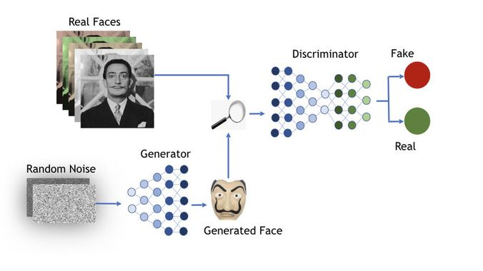

<!-- -->

# Auto-Generated Google Icons

In the the same logic of generated fake human faces using Generative Adversarial Networks, this project is to reproduce this algorithm for are more simple application (in order to be doable on a single laptop).
The idea is to generate fakes Google Icons that come from Google Play Applications which are available on Internet using Scrapping.

## 👩‍💻 Topics
1. Generate Database of Google Icons using an existing library on Node.js
2. Train a GAN model to reproduce realistic icons

## Authors
David Szmul - [Github](https://github.com/DavidSzmul) | [LinkedIn](https://www.linkedin.com/in/david-szmul-207564134/)   
